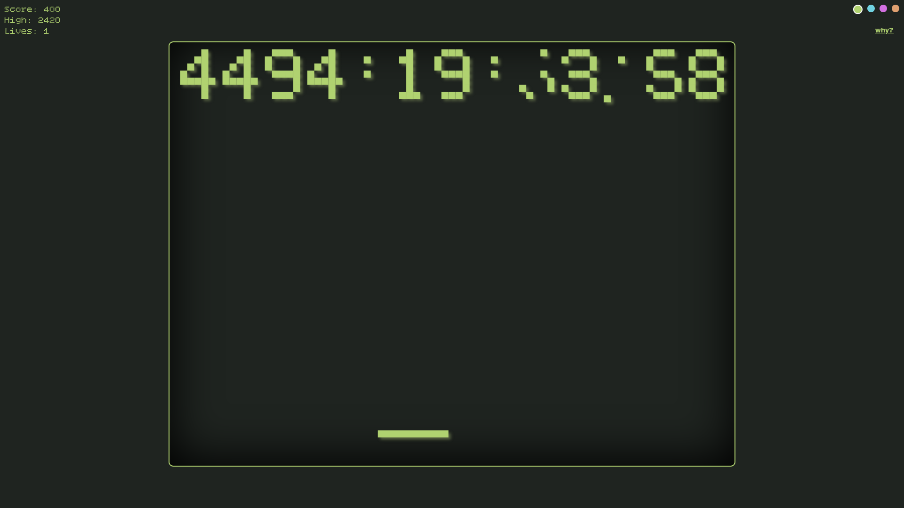

<div align="center">
  <h1>y2k38</h1>
  
</div>

## About

y2k38 is a playful browser game inspired by the Year 2038 problem (Y2K38 bug), where 32-bit systems will overflow and break timekeeping. Break the digits, keep the ball alive, and see how long you last until 2038!


## Screenshots

<div align="center">
  
</div>

## Local Setup

```bash
npm install
npm run dev
```

## License

This project is licensed under the [MIT LICENSE](./LICENSE).